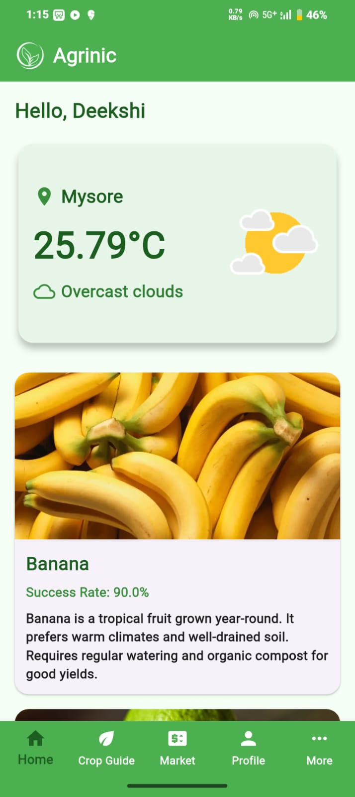

# Agrinic: An Organic Farming Application

Agrinic is a mobile application designed to guide farmers and agricultural enthusiasts in practicing **organic farming** efficiently. It helps users access crop-specific guides, seasonal crop suggestions, and market prices — all in one platform.  
The main goal of Agrinic is to promote sustainable agriculture by reducing dependency on chemical fertilizers and supporting eco-friendly farming practices.

---

## Features

- **Organic Crop Guide** – Step-by-step guidance for growing crops organically.  
- **Seasonal Crop Suggestions** – Know which crops to grow in each season.  
- **Market Prices** – Stay updated with real-time market prices for various crops.  
- **Weather Information** – Displays real-time weather to support farming decisions.  
- **Admin Panel** – Admins can add or update crop prices securely.  
- **User-Friendly Interface** – Simple and intuitive design built using Flutter.

---

## Tech Stack

- **Frontend:** Flutter  
- **Backend:** Firebase (Firestore, Authentication)  
- **API Integration:** OpenWeatherMap API  
- **Database:** Firebase Firestore  
- **Tools Used:** Android Studio, VS Code  

---

## 📸 Screenshots  

| Home Screen | Market Price Screen | Crop Categories |
|----------------|------------------------|--------------------|
|  |  |  |

| Fruits Category | Vegetables Category | Crop Guide |
|--------------------|------------------------|---------------|
|  |  |  |

---

## Installation

1. Clone this repository  
   
   git clone https://github.com/Deekshi082/Agrinic-An-Organic-Farming.git

Open the project in Android Studio or VS Code

Run flutter pub get to install dependencies

Connect your Firebase project

Run the app on an emulator or device

flutter run

Developed By

Deekshith S
📧 deekshi082@gmail.com

feel free to use and modify with credit.
